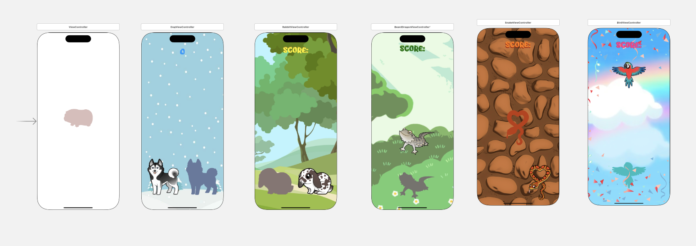
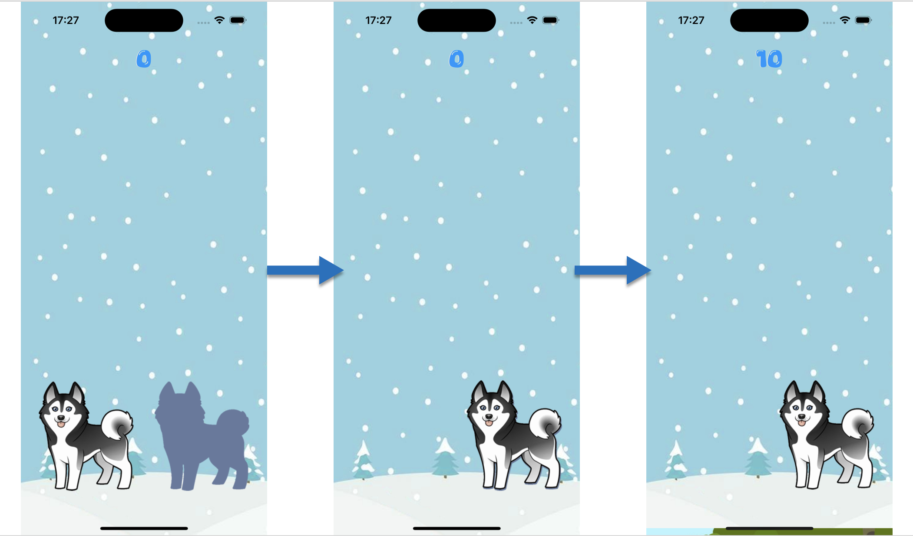

# Place the Animals

**PT-BR:**
Repósitorio de um mini jogo infantil Drag&Drop, onde o usuário deve arrastar o desenho para sua respectiva sombra. Implementado em 2021, refatorado em 2024.

Esse minijogo inicialmente iria fazer parde do meu pré tcc ( pré trabalho de conclusão de curso; Sistemas de Informação; Universidade Presbiteriana Mackenzie), como foram implementados outros minijogos no lugar, decidi abrir esse repositório e refatorar o codigo e o projeto depois de 3 anos. (2024)

Linguagens utilizadas para implementação: Swift e Objective-c.

**Storyboard com as telas disponíveis:**

**Demostração do jogo:**

Arraste o animal até sua sombra, para seguir para a próxima tela onde contém outro animal. Quando o animal é fica no lugar de sua sombra, a pontuação do jogo é atualizada.

**EN-US**:
Repository of a children's mini Drag & Drop game, where the user must drag the drawing to its respective shadow. Initially implemented in 2021, refactored in 2024.

This mini-game was originally intended to be part of my final project (Conclusion Graduation work; Information Systems; Universidade Presbiteriana Mackenzie). As other mini-games were implemented instead, I decided to open this repository and refactor the code and project after 3 years (2024).

Languages used for implementation: Swift and Objective-C.

**Storyboard with available screens:**

**Gameplay demonstration:**

Drag the animal to its shadow to proceed to the next screen containing another animal. When the animal is placed in its shadow, the game's score is updated.

